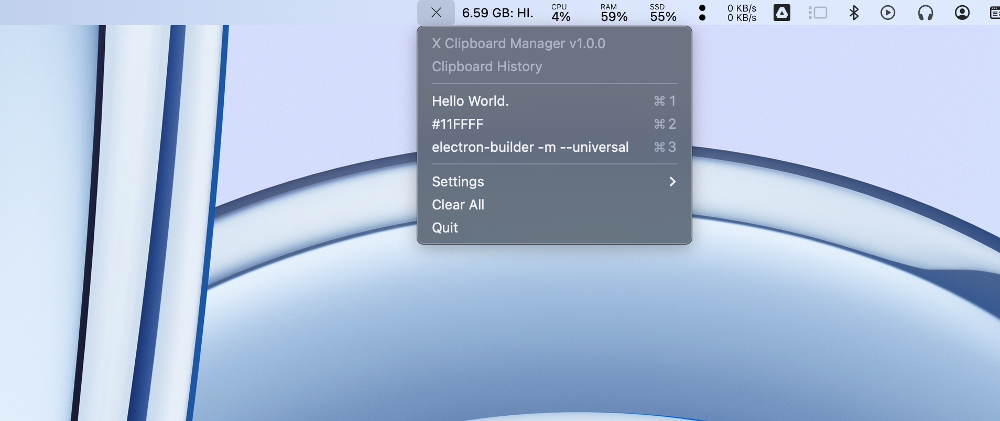

 

 

  

<h3 align="center">XCM</h3>

  

    The Simplest Clipboard Manager For MacOS
     
    <a href="https://github.com/problaze20/xcm"><strong>Install »</strong></a>
     
     
    <a href="https://github.com/problaze20/xcm/LICENSE">License</a>
    &middot;
    <a href="https://github.com/problaze20/xcm/issues/new?labels=bug&template=bug-report---.md">Report Bug</a>
    &middot;
    <a href="https://github.com/problaze20/xcm/issues/new?labels=enhancement&template=feature-request---.md">Request Feature</a>
  

A Electron Clipboard Manager for MacOS that sits in your menu bar and keeps track of your clipboard history.

<!-- ROADMAP -->
## Roadmap

- [ ] Add Support For Windows
- [ ] Add Support For Linux
- [ ] Switch To Tauri

See the [open issues](https://github.com/problaze20/xcm/issues) for a full list of proposed features (and known issues).

(<a href="#top">back to top</a>)

